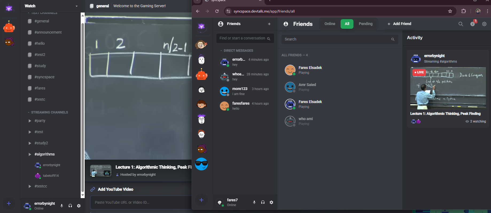
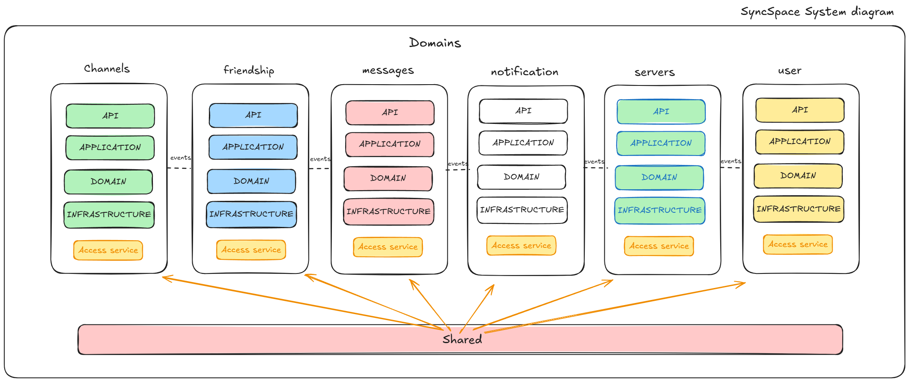

# 🚀 SyncSpace - Real-Time Collaboration Platform

[](LICENSE)
[](https://spring.io/projects/spring-boot)
[](https://angular.io/)
[](https://www.docker.com/)

> A feature-rich, Discord-inspired real-time collaboration platform built with modern modular monolith architecture patterns, emphasizing scalability, performance, and clean code principles.

## 📸 Application Screenshots


*Real time streaming*

## 🏗️ Architecture Overview



SyncSpace implements a **Modular Monolith Architecture** with **Event-Driven Design**, providing the perfect balance between simplicity and modularity. Unlike traditional monoliths, each module is independently developed with clear boundaries, while avoiding the complexity of distributed microservices. The system is composed of six independent modules, each following **Clean Architecture** principles.

### 🎯 Key Architectural Highlights

- **Modular Monolith**: 6 independent modules with clear boundaries and shared kernel - single deployment unit
- **Clean Architecture**: Each module follows API → Application → Domain → Infrastructure layers
- **Event-Driven Communication**: Asynchronous inter-module communication via domain events (in-process)
- **CQRS Pattern**: Command-Query Responsibility Segregation for optimized read/write operations
- **Strategic DDD**: Domain-Driven Design with bounded contexts
- **Single Database**: Shared PostgreSQL with schema-per-module approach for logical separation

## 🛠️ Technology Stack

### Backend
- **Spring Boot 3.x** - Enterprise-grade Java framework
- **Spring Security** - OAuth 2.0 Resource Server
- **Spring WebSocket (STOMP)** - Real-time bidirectional communication
- **Spring Data JPA** - ORM with Hibernate
- **Spring Events** - Asynchronous event processing

### Frontend
- **Angular 17+** - Modern TypeScript framework
- **RxJS** - Reactive programming for real-time updates
- **WebSocket/STOMP** - Client-side real-time communication

### Infrastructure
- **Keycloak** - Identity and Access Management (OAuth 2.0/OIDC)
- **PostgreSQL** - Primary relational database
- **Redis** - Distributed caching and session management
- **Flyway** - Database migration management
- **Docker & Docker Compose** - Containerization and orchestration
- **Nginx** - Reverse proxy and load balancer
- **AWS EC2** - Cloud deployment platform

## 🚀 Core Features

### 1. Server Management
- Create and manage multiple servers with custom configurations
- Role-based access control (RBAC) with hierarchical permissions
- Invite system with expirable codes and usage limits
- Public/Private server modes

### 2. Channel System
- **Text Channels**: Real-time messaging with rich media support
- **Activity Rooms**: Synchronized video/media watching experience
- **Private Channels**: Restricted access channels
- **Group Channels**: Multi-user private conversations

### 3. Real-Time Communication
- WebSocket-based instant messaging
- Typing indicators and presence detection
- Message attachments with cloud storage
- Cursor-based pagination for efficient message loading

### 4. Activity Synchronization
- Synchronized video playback across users
- Real-time state management (play, pause, seek)
- Viewer tracking and hoster controls
- Multi-room support with independent states

### 5. Social Features
- Friend requests and friendship management
- Direct messaging between friends
- User presence and online status
- Notification system with read/unread states

### 6. Advanced Features
- **Cursor Pagination**: Efficient infinite scrolling for messages
- **Optimistic Locking**: Preventing concurrent modification conflicts
- **Event Sourcing**: Complete audit trail of system changes
- **Caching Strategy**: Multi-level caching for improved performance

## 📦 System Modules

```
├── 🔐 Authentication Module
│   ├── Keycloak integration
│   ├── JWT token management
│   └── User session handling
│
├── 💬 Messaging Module
│   ├── Real-time chat
│   ├── Message persistence
│   └── Attachment management
│
├── 🏢 Server Module
│   ├── Server CRUD operations
│   ├── Member management
│   └── Invite system
│
├── 📺 Channel Module
│   ├── Channel creation
│   ├── Activity rooms
│   └── Access control
│
├── 👥 Friendship Module
│   ├── Friend requests
│   ├── Friendship status
│   └── Direct messaging
│
└── 🔔 Notification Module
    ├── Event-driven notifications
    ├── Real-time delivery
    └── Read status tracking
```

## ⚡ Performance Optimizations

### Database Level
- **Indexed Queries**: Strategic indexing on frequently queried columns
- **Connection Pooling**: HikariCP for optimal connection management
- **Query Optimization**: N+1 problem prevention with JOIN FETCH
- **Cursor Pagination**: Memory-efficient data loading
- **Schema-per-Module**: Logical data separation within single database

### Application Level
- **Redis Caching**:
    - Session storage
    - Frequently accessed data
    - Real-time presence information
- **Async Processing**: Non-blocking event handling with Spring's @Async
- **In-Process Events**: Fast inter-module communication without network overhead
- **Lazy Loading**: On-demand data fetching
- **DTO Projections**: Optimized data transfer

### Modular Monolith Benefits
- **Single Deployment**: Simplified deployment and operations
- **ACID Transactions**: Cross-module transactions when needed
- **No Network Latency**: In-process communication
- **Easier Debugging**: Centralized logging and tracing
- **Lower Infrastructure Costs**: Single application instance

## 🔒 Security Features

- **OAuth 2.0 / OpenID Connect**: Industry-standard authentication
- **JWT Tokens**: Stateless authentication with short-lived tokens
- **Custom Keycloak Providers**: Extended authentication logic
- **CORS Configuration**: Secure cross-origin requests
- **SQL Injection Prevention**: Parameterized queries
- **XSS Protection**: Input sanitization and validation
- **CSRF Protection**: Token-based verification

## 🐳 Deployment Architecture

### Docker Compose Services

```yaml
Services:
├── PostgreSQL (Application DB)
├── PostgreSQL (Keycloak DB)
├── Keycloak (Auth Server)
├── Redis (Cache & Sessions)
├── Spring Boot API
└── Nginx (Reverse Proxy)
```

### Infrastructure Setup
- **Cloud Provider**: AWS EC2
- **Reverse Proxy**: Nginx with SSL/TLS
- **Domain**: Custom domain with HTTPS
- **Container Orchestration**: Docker Compose

## 🚀 Getting Started

### Prerequisites

- Docker & Docker Compose
- Java 17+
- Node.js 18+
- PostgreSQL 14+
- Redis 7+

### Local Development Setup

1. **Clone the repository**
```bash
git clone https://github.com/fares7elsadek/SyncSpace-SpringBoot
cd SyncSpace-SpringBoot
```

2. **Configure environment variables**
```bash
# Create .env file
cp .env.example .env

# Update the following variables:
POSTGRES_USER=your_db_user
POSTGRES_PASSWORD=your_db_password
KEYCLOAK_ADMIN=your_admin_user
KEYCLOAK_ADMIN_PASSWORD=your_admin_password
```

3. **Start services with Docker Compose**
```bash
docker-compose up -d
```

4. **Access the application**
- Frontend: `http://localhost:80`
- API: `http://localhost:80/api/v1`
- Keycloak Admin: `http://localhost:80/auth/admin`

### Production Deployment

1. **Update docker-compose.yml for production**
```yaml
# Remove default credentials
# Update environment variables
# Configure SSL certificates
# Set up proper networking
```

2. **Deploy to AWS EC2**
```bash
# SSH into EC2 instance
ssh -i your-key.pem ec2-user@your-instance-ip

# Clone repository
git clone https://github.com/fares7elsadek/SyncSpace-SpringBoot

# Configure Nginx with SSL
sudo certbot --nginx -d yourdomain.com

# Start services
docker-compose up -d
```

3. **Configure Nginx Reverse Proxy**
```nginx
# See default.conf for complete configuration
upstream api {
    server syncspace-api:8080;
}

upstream keycloak {
    server keycloak:8080;
}
```

## 📚 API Documentation

The API follows RESTful principles with comprehensive OpenAPI 3.1 specification.

### Base URL
```
https://syncspace.devtalk.me/api/v1
```

### Authentication
All endpoints require Bearer token authentication:
```bash
Authorization: Bearer <your_jwt_token>
```

### Key Endpoints

#### Servers
- `GET /server` - List user servers
- `POST /server` - Create new server
- `GET /server/{serverId}` - Get server details
- `POST /server/{serverId}/invite` - Generate invite code

#### Channels
- `POST /channels/new` - Create channel
- `GET /channels/{channelId}` - Get channel details
- `POST /channels/{channelId}/members/{memberId}` - Add member

#### Messages
- `POST /message` - Send message
- `GET /message/channel/{channelId}` - Get messages (cursor pagination)
- `POST /message/attachment` - Upload attachment

#### Activity Rooms
- `POST /channels/room/{roomId}/connect` - Join room
- `POST /channels/room/control` - Control playback
- `GET /channels/room/{channelId}` - Get room state

For complete API documentation, see the [OpenAPI specification](./docs/api-spec.json).

## 📊 Monitoring & Observability

- **Keycloak Metrics**: Authentication analytics
- **Application Logs**: Structured logging
- **Health Endpoints**: Service status monitoring
- **Redis Monitoring**: Cache hit rates
- **Database Metrics**: Query performance

## 🔄 Event-Driven Architecture (In-Process)

### Event Types
- **Domain Events**: Business logic changes within modules
- **Integration Events**: Cross-module communication (synchronous/asynchronous)
- **System Events**: Infrastructure notifications

### Event Flow (Modular Monolith)
```
Action → Command → Domain Event → @EventListener → Integration Event → @Async Handler
```

### Benefits of In-Process Events
- **Transaction Consistency**: Events within same transaction boundary
- **Zero Network Latency**: Direct method calls
- **Simplified Debugging**: Single application context
- **Easy Testing**: No need for message broker setup
- **Future-Proof**: Can migrate to message broker if needed

## 🤝 Contributing

Contributions are welcome! Please follow these guidelines:

1. Fork the repository
2. Create a feature branch (`git checkout -b feature/amazing-feature`)
3. Commit your changes (`git commit -m 'Add amazing feature'`)
4. Push to the branch (`git push origin feature/amazing-feature`)
5. Open a Pull Request

## 📝 License

This project is licensed under the MIT License - see the [LICENSE](LICENSE) file for details.

## 👨‍💻 Author

**Fares Elsadek**
- GitHub: [@fares7elsadek](https://github.com/fares7elsadek)
- LinkedIn: [Fares Elsadek](https://www.linkedin.com/in/fares-elsadek)

## 🙏 Acknowledgments

- Spring Boot community for excellent documentation
- Keycloak team for robust IAM solution
- Angular team for powerful frontend framework
- Open source community for inspiration and tools

---

**Note**: This is a portfolio project demonstrating enterprise-level architecture and modern development practices. Feel free to use it as a reference or starting point for your own projects.

## 🎯 Future Enhancements

- [ ] Voice channels with WebRTC
- [ ] Screen sharing capabilities
- [ ] Mobile applications (iOS/Android)
- [ ] Bot integration system
- [ ] Advanced moderation tools
- [ ] Analytics dashboard
- [ ] Migration path to microservices (if needed)
- [ ] GraphQL API option
- [ ] Message broker integration for external systems

---

Made with ❤️ by Fares Elsadek